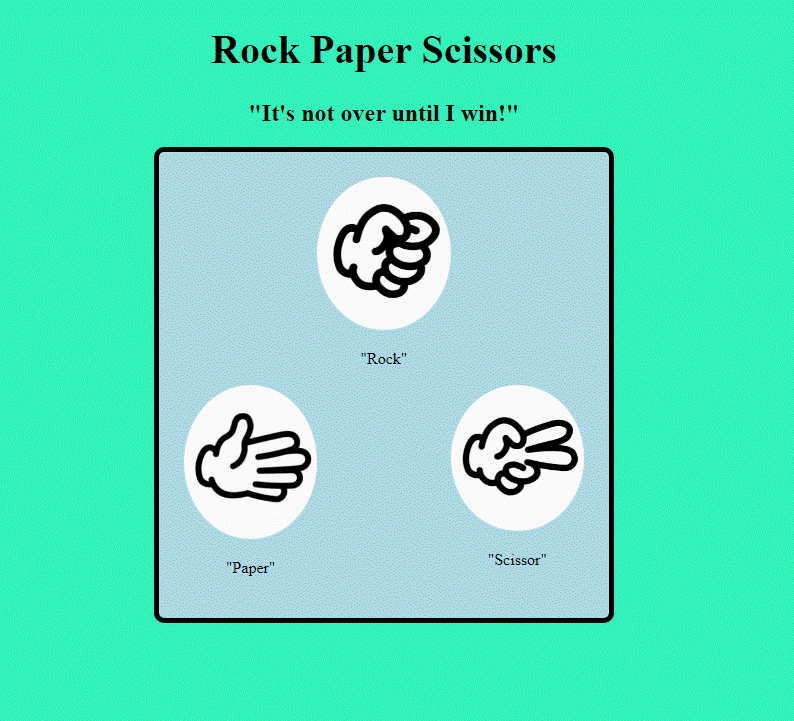
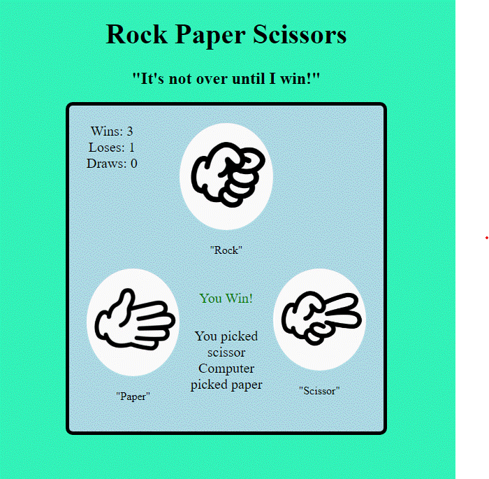

## Rock Paper Scissor Game

Rock paper scissor game made with basic HTML, CSS and JavaScript

Try it out [here](https://fritzchips.github.io/Rock-Paper-Scissor/)

## Instructions

- Choose one of the three: Rock, Paper or Scissor

- The computer will randomly choose one of the three

- Middle screen will show results of the choice between you and the computer

- Top left will show the total score since the game began

## Summary

I created this project to help me learn about clean non-repetitive code. When the user clicks rock, paper or scissor, the DOM cycles through all the images and uses the value given to determine the winner. Great project to understand the use of `DOM` in JavaScript.

## Author

---

- **Fritz Solibio** - _Software Developer_ [LinkedIn](https://www.linkedin.com/in/fritz-solibio-4aa9b321b/) | [Website](https://www.fritzsolibio.ca/)
